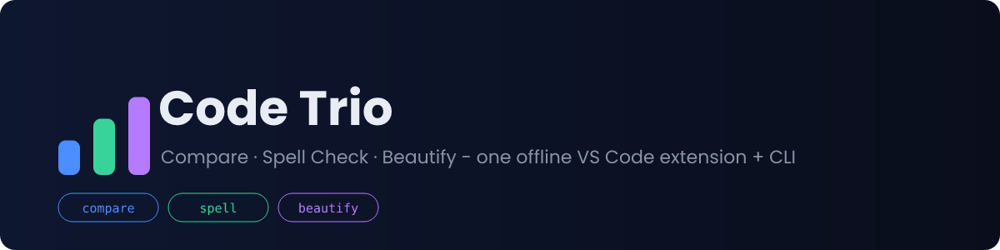
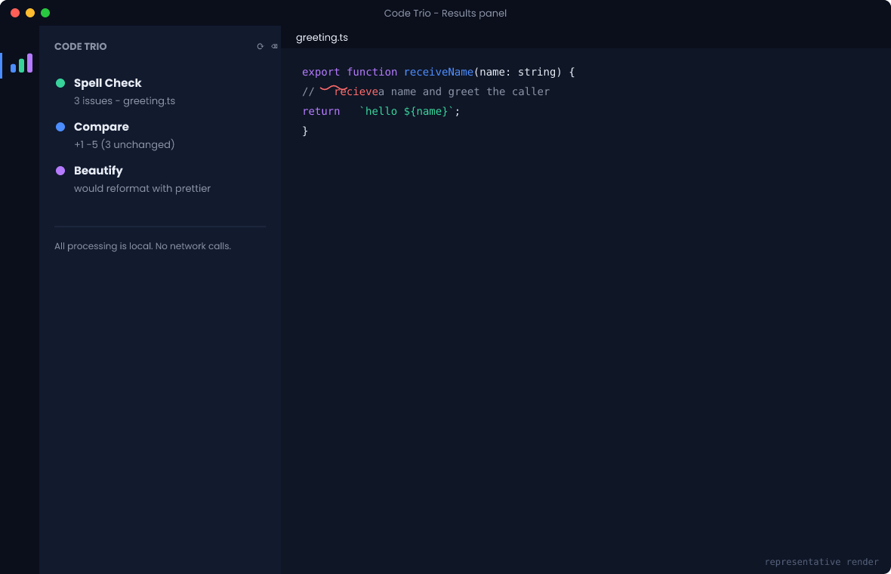
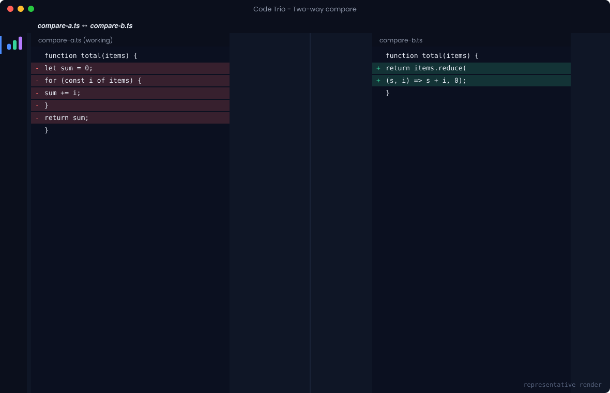
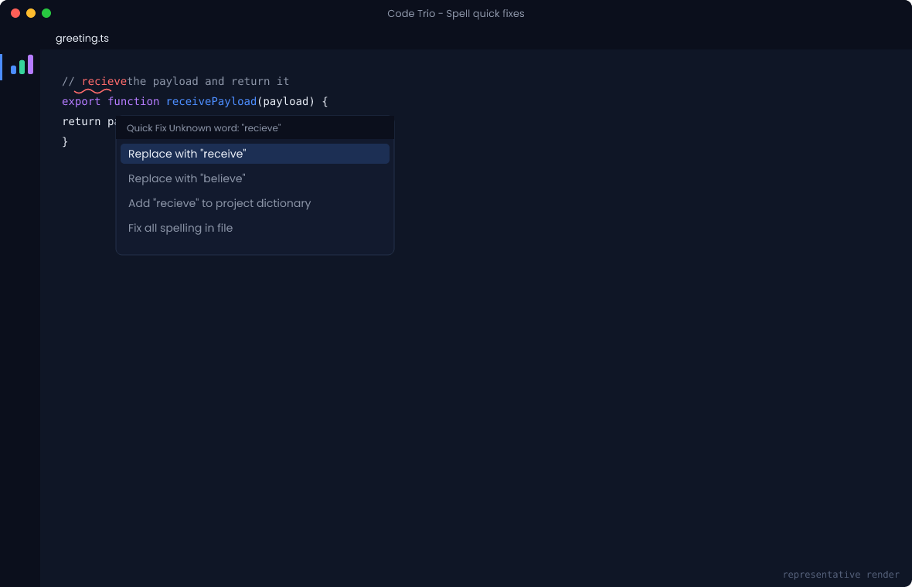
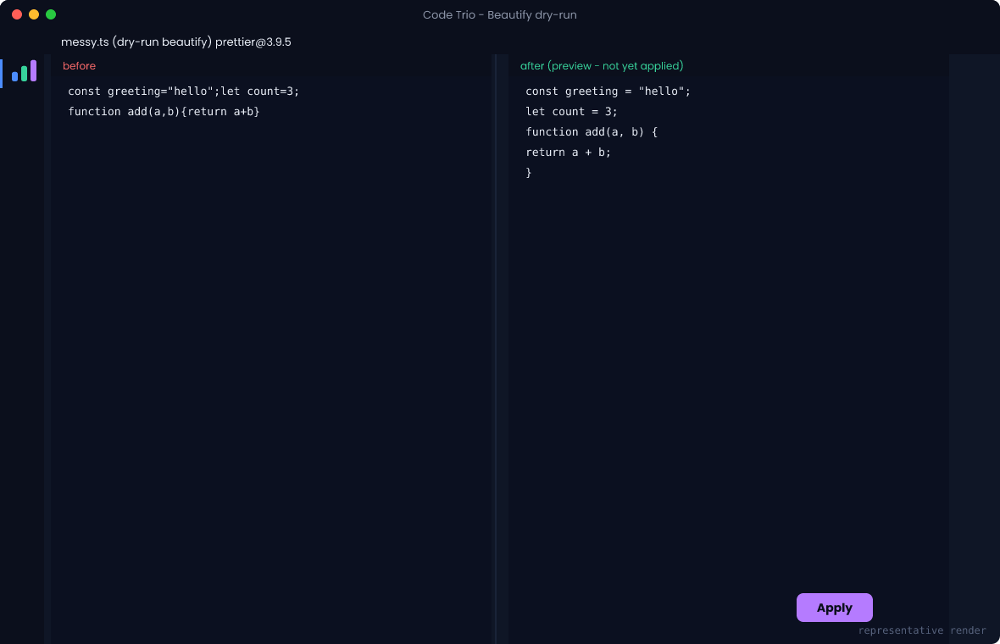
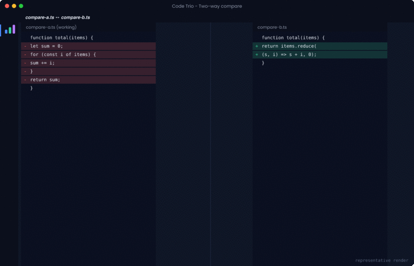
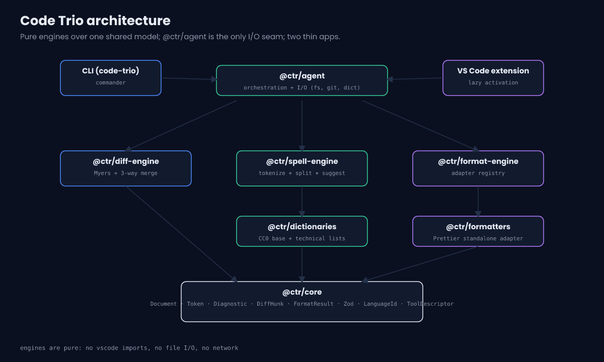

<p align="center">
  
</p>

<p align="center">
  <a href="https://github.com/aniketsoni1/code-trio-compare-beautify-spellcheck/actions/workflows/ci.yml"></a>
  <a href="LICENSE"></a>
  
  
  <a href="https://marketplace.visualstudio.com/items?itemName=AniketSoni.code-trio-compare-beautify-spellcheck"></a>
  
</p>

# Code Trio - Compare Beautify Spellcheck

**Code Trio** bundles the three tools you reach for every day - a **code compare/diff** view, a **code-aware spell checker**, and a **code beautifier/formatter** - into one deterministic, offline, privacy-respecting package. It ships as both a cross-platform CLI (`code-trio`) and a VS Code extension, both built on one shared TypeScript core so the three features compose instead of colliding.

Everything runs locally. There are no network calls and no telemetry, ever.

## Why Code Trio

Most teams stitch these three jobs together from separate extensions and CLIs that each carry their own config, model, and quirks. Code Trio uses **one document/AST model** and **one diagnostics model** across all three tools, so a spell issue, a diff summary, and a format preview all read like parts of the same product. The engines are pure functions with no I/O, which keeps them fast, testable, and reusable (they could back a Language Server later).

## Features

Compare / Diff - two-way diff at line, word, or character granularity, with ignore-whitespace, ignore-case and ignore-line-ending options. Compare two files, two files selected in the Explorer, a file against the clipboard, a selection against the clipboard, an unsaved buffer against the version on disk, or a file against any git ref. Word and character refinement is Unicode-correct, so accented characters and emoji sequences are never split mid-glyph. Binary, oversized and minified inputs are refused or downgraded with an explicit reason rather than silently mishandled.

Three-way merge - diff3 with conflict navigation, accept ours / theirs / both / base, manual resolution, and a preview before anything is written. Reads git's conflict stages directly, so it works on a real conflicted working tree. Saving writes to a new file by default and refuses outright while any conflict is unresolved. Git staging is never touched.

Spell Check - tokenizes source into identifiers, comments, and strings, and splits `camelCase`, `snake_case`, `kebab-case`, and `SCREAMING_CASE` before checking. Only comments and strings are checked by default (identifiers are opt-in). URLs, file paths, hashes, UUIDs, hex values, versions, timestamps and base64 blobs are suppressed before any word is extracted, which cut false positives from 28 to 9 on a fixture of realistic comments. Six dictionary scopes with documented precedence, including per-folder dictionaries for monorepos and multi-root workspaces.

Beautify / Format - a capability-aware adapter system. Prettier is bundled; Ruff, Black, gofmt, rustfmt and clang-format are used when you already have them installed. Nothing is ever downloaded, and a missing formatter says so instead of silently falling through. Deterministic output, a dry-run diff preview before anything is written, opt-in format-on-save, and workspace-wide formatting behind an explicit confirmation. Formatter versions and resolved executable paths are recorded for reproducibility.

## Screenshots

> **These are representative renders produced by `npm run assets`, not screenshots of the running extension.** They illustrate the layout; they are not evidence of behaviour. [docs/media.md](docs/media.md) has the checklist for capturing genuine screenshots.

| Unified results panel | Two-way compare |
| --- | --- |
|  |  |

| Spell quick fixes | Beautify dry-run preview |
| --- | --- |
|  |  |



## Quick start

### VS Code extension

Install the packaged VSIX (see [Releases](https://github.com/aniketsoni1/code-trio-compare-beautify-spellcheck/releases) or build it yourself):

```bash
npm ci
npm run package:vsix
code --install-extension artifacts/code-trio-compare-beautify-spellcheck-0.1.0.vsix
```

Open a folder, then use the **Code Trio** panel in the Activity Bar, or the `Code Trio:` commands in the Command Palette.

### CLI

```bash
npm ci
npm run build:cli
node apps/cli/dist/cli/index.cjs --help
# or run from source during development:
npm run cli -- diff a.ts b.ts --words
```

## CLI usage

```bash
# Compare two files, refined at word level
code-trio diff src/a.ts src/b.ts --words

# Compare a file against a git ref
code-trio diff src/a.ts --ref HEAD --format unified

# Spell check a glob (comments and strings by default); fail CI on any issue
code-trio spell "src/**/*.ts" --fail-on information

# Check formatting (like prettier --check), then apply
code-trio format "src/**/*.ts" --check
code-trio format "src/**/*.ts" --write

# Scaffold config + project dictionary, and inspect the environment
code-trio init
code-trio doctor
code-trio configure

# Three-way merge, including directly on a conflicted working-tree file
code-trio merge --base b.txt --ours o.txt --theirs t.txt
code-trio merge conflicted.ts --git --accept ours -o merged.ts

# Which formatters are actually available on this machine
code-trio formatters

# Dictionary scopes
code-trio dictionary list
code-trio dictionary check kubernetes

# Combined report, in the same format the results panel exports
code-trio report "src/**/*.ts" --format markdown

# The stable exit-code table
code-trio exit-codes
```

Full reference: [docs/cli.md](docs/cli.md).

## Extension usage

31 commands, all prefixed `Code Trio:`. Compare against a file, two Explorer selections, the clipboard, a selection, the saved version on disk, a git ref, or the previous revision. Merge from git stages or three chosen files, with next/previous conflict navigation. Spell check a file or the workspace, fix all, add to a chosen dictionary scope, ignore for the session, open any dictionary, and show which sources were consulted. Beautify a document, preview it, beautify changed files or the whole workspace, and show which formatters are available.

Default keybindings: `Ctrl/Cmd+Alt+B` previews beautify, `Ctrl/Cmd+Alt+S` spell-checks the current file, `Ctrl/Cmd+Alt+]` and `[` move between merge conflicts.

## Configuration

Settings are namespaced per feature (`codeTrio.diff.*`, `codeTrio.spell.*`, `codeTrio.format.*`) and can also live in a `codetrio.json` file the CLI discovers by walking up from the working directory. Highlights:

| Setting | Default | Purpose |
| --- | --- | --- |
| `codeTrio.diff.granularity` | `word` | line / word / char refinement |
| `codeTrio.spell.checkIdentifiers` | `false` | also spell-check identifiers |
| `codeTrio.spell.severity` | `information` | diagnostic severity |
| `codeTrio.spell.projectDictionaryPath` | `.codetrio/dictionary.txt` | shared project words |
| `codeTrio.format.formatOnSave` | `false` | beautify on save (opt-in) |
| `codeTrio.format.previewBeforeApply` | `true` | show a dry-run before applying |

Full reference: [docs/configuration.md](docs/configuration.md).

## Privacy and security

Code Trio never opens a network connection and collects no telemetry. Formatting and diffing are pure computations. The only operations that touch your files are explicit writes - applying a format, editing a dictionary, and saving a merge - and all are modeled as auditable write tools. In VS Code they are disabled in untrusted workspaces (the extension declares `limited` Workspace Trust support).

The results panel is a webview under a strict Content Security Policy: `default-src 'none'`, scripts and styles allowed only via a per-load nonce, no `unsafe-inline`, and no remote origin of any kind. Messages from the webview are validated at runtime against a schema rather than merely typed, and the webview can only request actions you could already invoke from the Command Palette. Git and external formatters are invoked with argument arrays and a minimal environment, never through a shell.

These are not aspirations: each is asserted by a test. See [SECURITY.md](SECURITY.md) and the full threat review in [docs/security-review.md](docs/security-review.md).

## Architecture



One shared model (`@ctr/core`) defines `Document`, `Token`, `Diagnostic`, `DiffHunk`, `FormatResult`, the Zod schemas, the `LanguageId` registry, and a `ToolDescriptor` permission model. Each engine (`diff-engine`, `spell-engine`, `format-engine`) is a **pure** function over that model with no VS Code imports and no file I/O. `@ctr/agent` is the only seam that wires the engines to the outside world (files, git, dictionaries) and is shared by both apps. More detail in [docs/architecture.md](docs/architecture.md).

```
apps/       cli/  vscode-extension/
packages/   core  diff-engine  spell-engine  format-engine  reporting
            configuration  agent  dictionaries  formatters  testing
samples/ docs/ .github/ scripts/ assets/
```

Performance is measured, not asserted: `npm run bench` runs an offline,
deterministic suite and [docs/performance.md](docs/performance.md) records the
results.

## Project dictionary

Teams share custom words through a checked-in `.codetrio/dictionary.txt` (one word per line; `#` comments; prefix `!` to force-allow a word). The built-in base and technical word lists are original, curated for Code Trio, and dedicated to the public domain under CC0-1.0 - see [docs/dictionaries.md](docs/dictionaries.md) for provenance.

## Limitations

The bundled dictionary is a common-word baseline (about 1,200 words) rather than a full English lexicon, so ordinary words are sometimes flagged; extend it per project. The spell tokenizer is a pragmatic scanner, not a full language parser, so exotic string/comment syntaxes may be approximated. The Prettier adapter covers JS/TS/JSON/CSS/Markdown/YAML/HTML; external formatters are used only if you already have them installed, and other languages fall back to a safe whitespace normalizer. Git-ref compare and git-stage merge require a local git binary. Character-granularity diffs of very long lines are slow by nature and are downgraded automatically for minified input. Code Trio does not verify the identity of a formatter executable you configure.

## Roadmap

An optional Language Server so other editors can reuse the engines, frequency-tiered suggestion ranking, and additional formatter adapters. Three-way merge UX, Ruff/gofmt/rustfmt adapters, per-folder dictionaries and the benchmark suite all shipped in v0.2.0.

## Contributing

Contributions are welcome. See [CONTRIBUTING.md](CONTRIBUTING.md) and our [Code of Conduct](CODE_OF_CONDUCT.md). In short: `npm ci`, then `npm run verify` (typecheck + lint + tests) before opening a PR.

## Release and install

Maintainers follow [RELEASE_CHECKLIST.md](RELEASE_CHECKLIST.md). Each tagged release attaches a verified VSIX plus a SHA-256 checksum. Install locally with `code --install-extension <vsix>`.

## License

Apache-2.0 (c) aniketsoni1. See [LICENSE](LICENSE) and [THIRD_PARTY_NOTICES.md](THIRD_PARTY_NOTICES.md).
